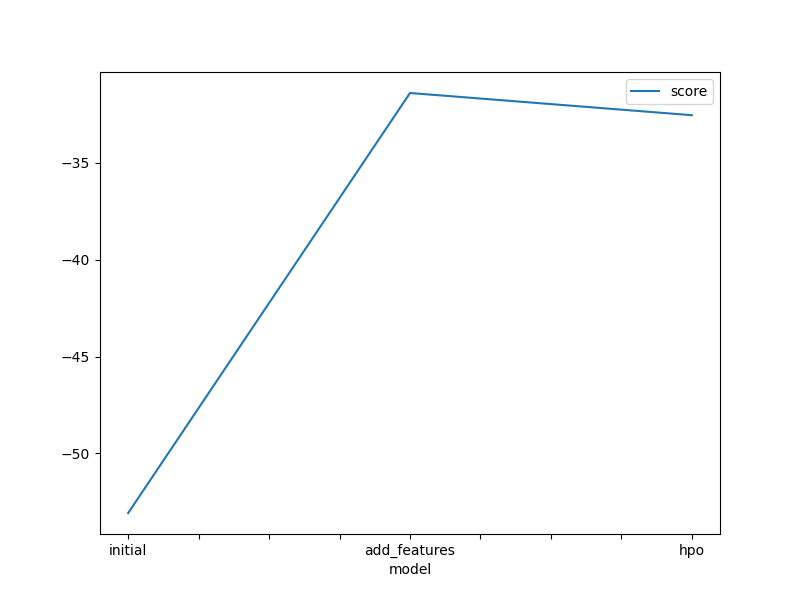
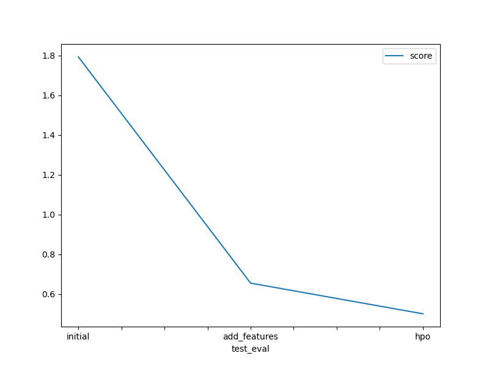

# Report: Predict Bike Sharing Demand with AutoGluon Solution

#### Avani Jain

## Initial Training

### What did you realize when you tried to submit your predictions? What changes were needed to the output of the predictor to submit your results?

The predictor was giving only the count as output, but we also needed the datetime column for the Kaggle submission, so we had to add it using the sample submission file.

### What was the top ranked model that performed?

We used AutoGluon’s leaderboard() to identify the best models ranked by root mean squared error (RMSE), where the first listed model is the best because AutoGluon sorts models by the smallest RMSE.
The top model in all three phases — initial, adding features and hyperparameter optimisation — was WeightedEnsemble_L3.
AutoGluon shows the best model first based on the smallest root mean squared error (RMSE). Sometimes the score might look negative due to how AutoGluon reports it, but a smaller value always means better performance.

Here are the scores (RMSE):
Initial: 53.073323462063605
Add Features: 31.405827037190313
Hyperparameter Optimisation: 32.55093813025615

These scores show how far off the model's predictions are from the real values. So, a smaller score means the model made more accurate predictions.

## Exploratory data analysis and feature creation

### What did the exploratory analysis find and how did you add additional features?

The exploratory analysis showed that bike demand varies significantly by hour of the day, season, holiday, and working day. Based on this, I added new feature hour, year, month and day extracted from the datetime column, which helped the model better capture time-based patterns in user demand. I also added correlation matrix of the train dataset.

### How much better did your model preform after adding additional features and why do you think that is?

After adding new features like hour, year, month, and day from the datetime column, the model's score improved a lot.
The RMSE dropped from 53.073323462063605 (initial model) to 31.405827037190313 (after adding features).

This means the model’s predictions became more accurate, with a much smaller average error.
This improvement likely happened because the new features gave the model more useful information about when the demand happens. For example, demand might be higher during certain hours or on specific days. The model was able to learn from these patterns and make better predictions.

## Hyper parameter tuning

### How much better did your model preform after trying different hyper parameters?

After applying hyperparameter optimization, the model's score changed slightly — from 31.405827037190313 (with added features) to 32.55093813025615 (after tuning).

This happened even though we used presets='best_quality', which usually helps AutoGluon search for the best model settings. We also tried a custom setup of hyperparameters that included models like GBM with ExtraTrees, CatBoost (500 iterations), Neural Networks, and XGBoost, and used hyperparameter_tune_kwargs='auto' to let AutoGluon run tuning automatically.

Hyperparameter tuning is important because it helps find the best settings for a machine learning model—like learning rate, tree depth, or number of iterations—that control how the model learns from data. Choosing the right hyperparameters can make the model more accurate and better at generalizing to new data, which leads to improved performance. Without tuning, the model might underfit or overfit, resulting in weaker predictions.
Even if the improvement is small or not immediate, tuning is essential for building strong machine learning models.

### If you were given more time with this dataset, where do you think you would spend more time?

I would try more advanced feature engineering and tune individual model hyperparameters in detail for further improvements.

### Create a table with the models you ran, the hyperparameters modified, and the kaggle score.

| model        | hpo1       | hpo2    | hpo3    | score   |
| ------------ | ---------- | ------- | ------- | ------- |
| initial      | default    | default | default | 1.79315 |
| add_features | default    | default | default | 0.65487 |
| hpo          | multimodal | auto    | auto    | 0.50058 |

### Create a line plot showing the top model score for the three (or more) training runs during the project.

### Create a line plot showing the top kaggle score for the three (or more) prediction submissions during the project.

## Summary

We learned that the best model was WeightedEnsemble_L3 throughout the project. We observed that adding features like hour, day, month, and year greatly improved the RMSE from 53.073323462063605 to 31.405827037190313, showing that time-based features help the model predict demand pattern better.

We also learned that hyperparameter tuning is important to optimize model performance. Working with AutoGluon helped us understand how easy it is to train and compare multiple models automatically. Given more time, we would focus on creating more features and fine-tuning models.
